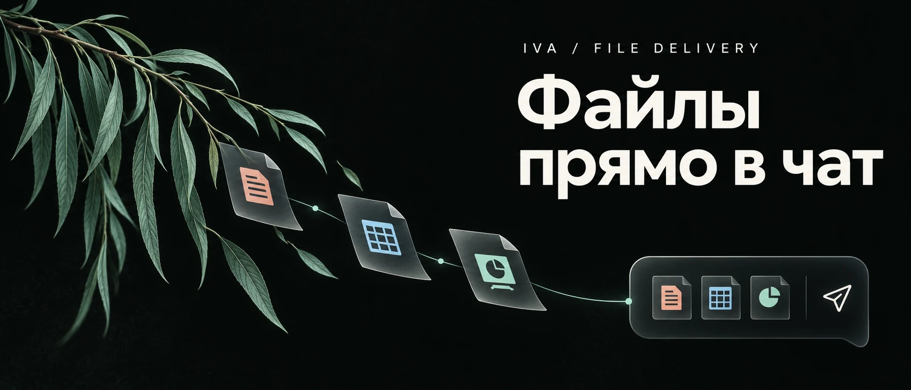
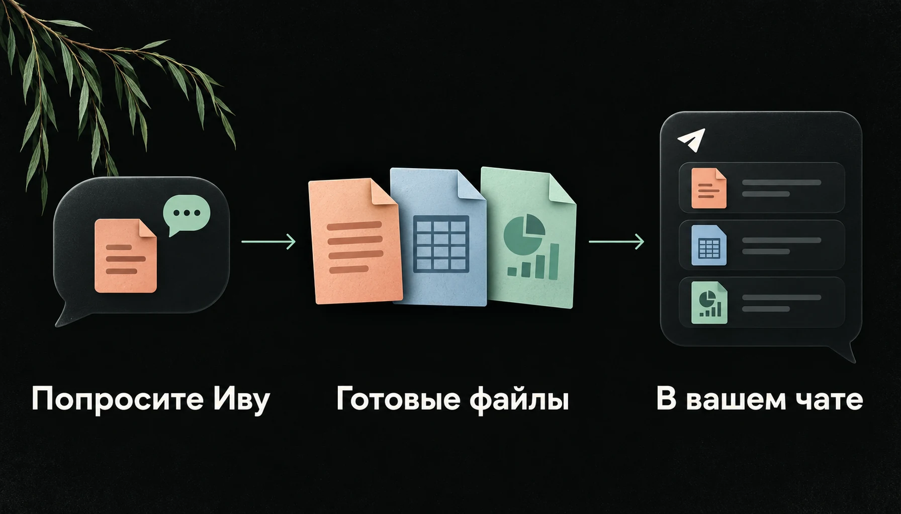

<div align="center">



# Файлы из Ивы прямо в Telegram

**Попросите Иву прислать результат файлом. Он появится в вашем личном чате.**

[](https://github.com/mamysh/iva-file-delivery/releases)
[](https://github.com/mamysh/iva-file-delivery/actions/workflows/ci.yml)
[](LICENSE)

[Что попросить](#что-попросить-у-ивы) · [Установить](#установить) · [Попробовать](#первый-файл-за-минуту) · [Обновить](#обновление-из-чата) · [Помощь](#если-нужна-помощь)

</div>

Ива подготовила отчёт, таблицу или презентацию? С этим плагином она может отправить готовый
файл прямо в переписку со своим Telegram-ботом. Вы скачиваете его, открываете или пересылаете
дальше. Если результатов несколько, они приходят вместе, даже когда форматы разные.

Плагин дополняет [Иву](https://github.com/smixs/iva-agent) и устанавливается отдельно.

## Что попросить у Ивы

| Напишите в чате | Что получите, если Ива подготовит файлы |
| --- | --- |
| «Собери итоги встречи в документ и пришли сюда файлом» | Документ, который можно скачать и переслать коллегам. |
| «Сделай таблицу расходов и пришли её как Excel-файл» | Таблицу вложением в переписке. |
| «Пришли готовую презентацию и PDF вместе» | Два документа одной группой. |
| «Пришли эту картинку как файл» | Картинку документом, без преобразования в Telegram-фото. |

**Ива создаёт результат, плагин доставляет его.** Доступные форматы зависят от инструментов
вашей Ивы. Плагин сам не создаёт документы и не конвертирует их.

## Как приходят файлы



1. Попросите Иву подготовить результат и прислать его файлом.
2. Ива создаст файл и отправит его от имени своего бота.
3. Откройте вложение в Telegram, скачайте или перешлите его.

Один файл приходит отдельным документом. От 2 до 10 файлов приходят одной группой;
больше 10 — несколькими группами. Все вложения отправляются как документы: картинки
остаются файлами, аудио не превращается в голосовое сообщение.

*Иллюстрации показывают сценарий; это не скриншоты интерфейса.*

## Установить

Нужна уже работающая Ива с Telegram-ботом. Плагин проверен на живой установке с Iva **0.4.3**.
Для более новых версий живая проверка пока не подтверждена;
[подробности совместимости](docs/COMPATIBILITY.md).

Один раз выполните на сервере под тем же пользователем, что и Иву:

```bash
iva plugin add mamysh/iva-file-delivery/plugin@stable --trust
```

Ива соберёт плагин и перезапустится. Новый бот, токен и отдельный файл настроек не нужны.
`--trust` включает отдельный процесс для обновлений из чата. Если нужны только файлы,
установите без этого флага.

Проверить установку:

```bash
iva plugin list
iva doctor
```

Пошаговая инструкция, установка конкретной версии и удаление — в
[руководстве](docs/SETUP.md).

## Первый файл за минуту

Откройте **личный чат с ботом Ивы** и отправьте:

> Создай небольшой текстовый файл с фразой «Проверка доставки» и пришли его сюда как файл.

В переписке появится документ от бота. Теперь попробуйте несколько файлов:

> Создай на вымышленных данных список покупок в TXT и таблицу расходов в CSV. Пришли оба файла вместе.

Они должны прийти одной группой. Специальные команды в чате не нужны.

## Что важно знать

- **Получатель — вы.** Отправка работает только в вашем текущем личном чате с ботом Ивы.
  Группы, каналы, другие получатели и отправка по расписанию не поддерживаются.
- **До 50 МБ на файл.** Пустые файлы не отправляются.
- **Файлы остаются у Ивы.** После отправки они не удаляются с сервера автоматически.
- **Содержимое выбираете вы.** Плагин не проверяет документы на секреты и личные данные.
  Убедитесь, что чувствительный файл можно отправлять через Telegram.

Плагин читает готовые файлы только из папки вложений Ивы (`vault/attachments/`). Обычно Ива
сама помещает туда результат; вручную указывать серверный путь в чате не требуется.
[Как устроена защита](SECURITY.md).

## Обновление из чата

Напишите Иве:

> Проверь обновление плагина доставки файлов.

Ива покажет текущую и новую версии, список изменений и предложит кнопки **Обновить** и
**Позже**. Обновление начнётся после нажатия кнопки; Ива может ненадолго перезапуститься.
Если проверка после установки не пройдёт, плагин попытается вернуть предыдущую версию.

Через минуту можно спросить:

> Как прошло обновление плагина доставки файлов?

Этот сценарий доступен при установке с `--trust`. Источник `@stable` получает следующие
проверенные выпуски. [Другие способы обновления](docs/SETUP.md#обновить-из-чата).

## Если нужна помощь

Файл не пришёл или обновление остановилось? Начните с
[подсказок по ошибкам](docs/SETUP.md#если-что-то-не-работает).
Если они не помогли, [сообщите о проблеме](https://github.com/mamysh/iva-file-delivery/issues).
Укажите версию Ивы, версию плагина и шаги на вымышленном примере.
Токен бота, личные файлы и полные журналы прикладывать не нужно.

| Подробнее | Где прочитать |
| --- | --- |
| Установка, обновление и удаление | [Руководство](docs/SETUP.md) |
| Проверенные версии Ивы | [Совместимость](docs/COMPATIBILITY.md) |
| Что изменилось в выпусках | [История версий](CHANGELOG.md) |
| Доступ к файлам и получателю | [Защита данных](SECURITY.md) |

<details>
<summary><b>Для тех, кто хочет улучшить плагин</b></summary>

Отправка работает как Eve Extension, обновление из чата — как отдельный MCP-процесс.
[Устройство плагина](docs/DESIGN.md) · [Как участвовать](CONTRIBUTING.md) ·
[Картинки и промпты](docs/VISUALS.md).

```bash
npm ci
npm run check
```

</details>

Независимый плагин для Ивы. Лицензия — [MIT](LICENSE).
